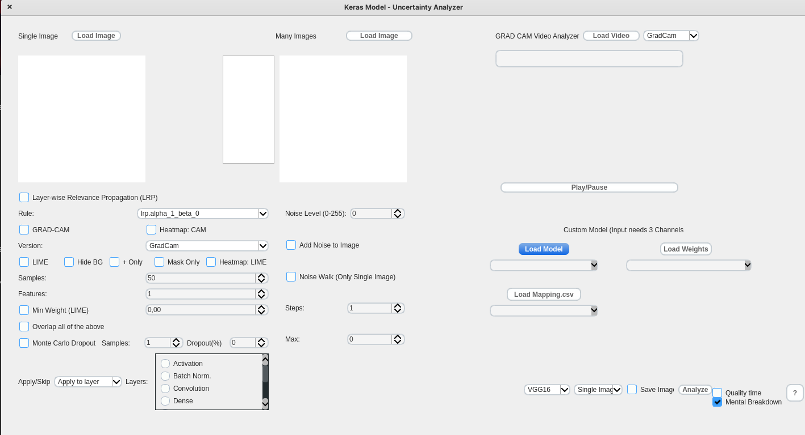

# DEEPL-Project
## Run the Project
### Requirements
```bash
pip install -r requirements.txt
```

## To run the GUI run in with your Python: 
```bash
<yourPythonRunCommand> gui.py
```

it should Look like this: 



For more Videos:

Normal: https://www.youtube.com/watch?v=2K9GPiie-Hk

Custom Model: https://www.youtube.com/watch?v=9mzIx_NVDJk